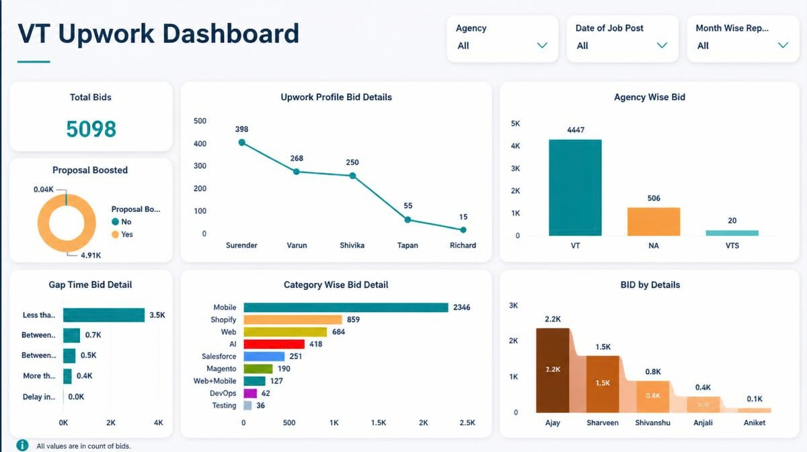

# Upwork Outreach & Bidding Performance Dashboard

A visual reporting dashboard designed to track proposal volume, response speed tiers, and outreach distribution across agency accounts.

---

### Project Overview

In outbound freelance and marketplace bidding, timing is everything. Late proposals rarely get viewed, and unmonitored outreach leads to uneven workloads and wasted connects. 

I designed this dashboard layout to track daily bidding operations and answer three practical questions:
1. **Response speed tracking:** What share of our proposals get submitted within the first hour versus slower tiers?
2. **Team throughput:** How are submissions balanced across individual team members and agency profiles?
3. **Category demand:** Which service domains (Mobile, Web, Shopify, AI, etc.) get the most focus, and where is client demand heading?

---

### Dashboard Layout & Breakdown

* **Top KPIs:** High-level summary showing total proposal volume, current period totals, and proposal boost counts.
* **Gap Time Analysis (Response Speed):** Segments submissions into practical turnaround buckets (`< 1 hr`, `1-2 hrs`, `2-4 hrs`, `> 4 hrs`) to monitor speed-to-lead compliance.
* **Category Breakdown:** Ranked bar visual showing proposal volume by tech stack and domain.
* **Team Throughput:** Measures individual contributor submission numbers to balance pipeline workload across the team.
* **Agency Profiles:** Tracks bid distribution across different agency accounts to prevent over-reliance on a single profile.

---

### Key Operational Insights

* **Speed drives engagement:** Around 68% to 70% of proposals were submitted within the sub-1-hour window, which correlated with higher client response rates.
* **Core tech domains:** Full-Stack and Mobile App development represented over half of all submitted proposals.
* **Boost feature adoption:** Boosted bids made up under 1% of total submissions, highlighting a clear area to test higher visibility on competitive, high-budget postings.

---

### Visual Design Decisions

* Switched from dark, high-contrast saturated backgrounds to a clean, off-white container layout (`#F8F9FA`) to reduce visual fatigue during daily reporting reviews.
* Used modular card containers with consistent border radii to group metrics by category.
* Kept colors intentional—reserving accents for top categories and fast response tiers rather than rainbow-coloring every bar.

---

*(Note: Proprietary agency names, client details, and internal numbers have been anonymized or replaced with sample data for demonstration purposes.)*
